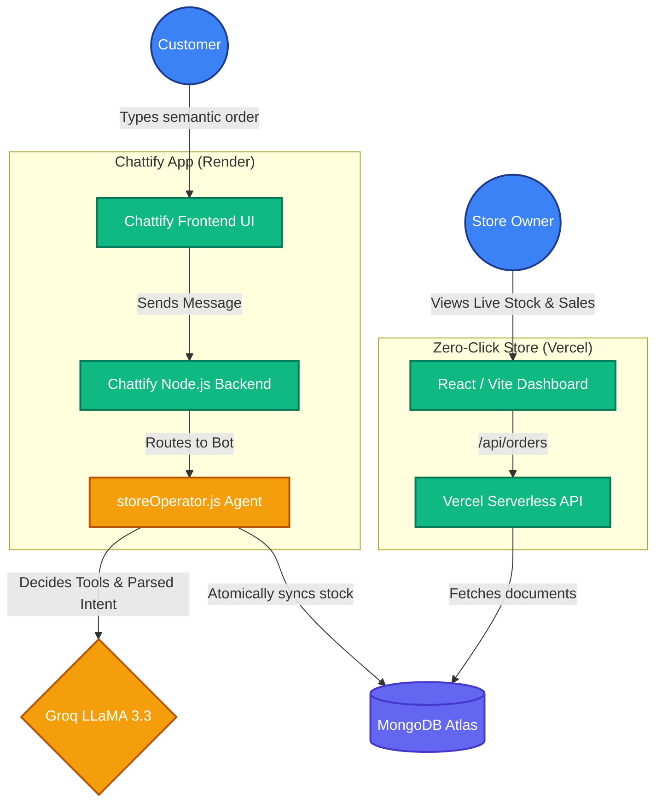

<div align="center">
  
  

  [](https://git.io/typing-svg)

  <p align="center">
    <a href="https://shop-ai-ten-sage.vercel.app"></a>
    <a href="https://chattify-zzsr.onrender.com"></a>
  </p>

</div>

---

# 🚀 Overview

This repository harbors a highly sophisticated, two-part microservice architecture. On one side, we have **Chattify**—a dynamic chat interface. On the other side, we have the **Zero-Click Store Operator**—a centralized dashboard and automated agent management engine. 

Both systems are natively integrated using **LlaMA 3.3 (via Groq)** to process semantic natural language orders and automatically reserve inventory against a unified **MongoDB Atlas** database, providing a 100% autonomous, zero-click e-commerce experience.

---

## 🔗 Live Deployments

| Application | Platform | URL |
| :--- | :--- | :--- |
| **Zero-Click Store Dashboard** | Vercel | [https://shop-ai-ten-sage.vercel.app](https://shop-ai-ten-sage.vercel.app) |
| **Chattify (Customer UI)** | Render | [https://chattify-zzsr.onrender.com](https://chattify-zzsr.onrender.com) |

---

## 🧠 System Architecture & Flowchart

The system runs completely decoupled across two different deployments, linked purely by the database and AI agent calls.



---

## 🛠️ Detailed Tech Stack

### 🧑‍💻 Frontend
* **React 18** (Vite Bundler for instant HMR)
* **Tailwind CSS v4** (Modern utility-first styling with custom Google Fonts)
* **Framer Motion / CSS Animations** (Custom animated intro screens)
* **Context API & Axios** 

### 🖧 Backend & Operator
* **Node.js & Express / Serverless**
* **MongoDB & Mongoose** (With strict schema mapping and atomic `$inc` stock logic)
* **Groq SDK (LLaMA 3.3 70B)** (For blazing-fast natural language parsing and JSON tool calling)
* **Socket.io** (For real-time chat sync)

---

## 💻 Local Setup & Commands

To run these completely separated systems on your own machine, you will effectively run two different servers on different ports.

### 1. Database Requirement
Before running either app, ensure you create a `.env` file in **both** directories holding the exact same connection string:
```bash
MONGODB_URI="mongodb+srv://<user>:<password>@cluster0.../chattify_db?appName=Cluster0"
GROQ_API_KEY="gsk_your_groq_key_here..."
```

### 2. Running Zero-Click Store (Dashboard)
This acts as your administrative console to view products, simulated health checks, and tracked orders.
```bash
cd zero-click-store
# Install Dependencies
npm install
# Run the local development server (Frontend + Backend on Port 3000/3001)
npm run dev
```

### 3. Running Chattify
This is where the user interacts with the bot via a chat interface.
```bash
# Terminal 1: Run the backend (Port 5001)
cd chattify/backend
npm install
npm run dev

# Terminal 2: Run the frontend (Port 5173)
cd chattify/frontend
npm install
npm run dev
```

---

<div align="center">
  
  <br/>
  <i>Engineered with ❤️ to eliminate clicks in commerce!</i>
</div>
